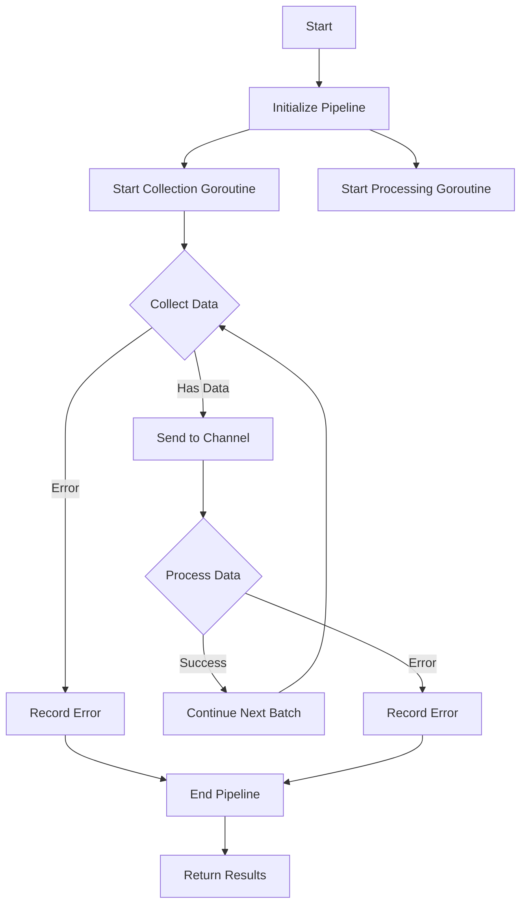

# AsyncDataPipeline

[English](README.md) | [中文](README_cn.md)

[](https://goreportcard.com/report/github.com/yourusername/asyncdatapipeline)
[](https://godoc.org/github.com/yourusername/asyncdatapipeline)
[](https://coveralls.io/github/yourusername/asyncdatapipeline?branch=master)
[](https://github.com/yourusername/asyncdatapipeline/actions)

AsyncDataPipeline is a high-performance asynchronous data processing pipeline specifically designed for scenarios requiring concurrent data collection and processing. It provides a simple and easy-to-use interface, supports custom data collection and processing logic, and delivers excellent performance.

## Features

-   Generic support for processing any type of data
-   Configurable number of concurrent worker goroutines
-   Automatic goroutine lifecycle management
-   Elegant error handling mechanism
-   Support for timeout and cancellation operations
-   Automatic idle state detection and shutdown

## Installation

```bash
go get github.com/rushairer/asyncdatapipeline
```

## Quick Start

```go
package main

import (
    "context"
    "fmt"
    "time"
    "github.com/rushairer/asyncdatapipeline"
)

type Data struct {
    ID   int
    Name string
}

func main() {
    // Create configuration
    config := &asyncdatapipeline.AsyncDataPipelineConfig{
        MaxWorkers: 4,
        IdleTime:   time.Second * 5,
    }

    // Define collection function
    collectFunc := func(ctx context.Context) ([]Data, error) {
        // Simulate data collection
        return []Data{{ID: 1, Name: "test"}}, nil
    }

    // Define processing function
    processFunc := func(ctx context.Context, data []Data) error {
        // Process data
        for _, d := range data {
            fmt.Printf("Processing data: %+v\n", d)
        }
        return nil
    }

    // Create pipeline
    pipeline, err := asyncdatapipeline.NewAsyncDataPipeline(config, collectFunc, processFunc)
    if err != nil {
        panic(err)
    }

    // Execute pipeline
    ctx := context.Background()
    reason, errors := pipeline.Perform(ctx)
    if len(errors) > 0 {
        fmt.Printf("Error: %v\n", errors[0])
    }
    fmt.Printf("Pipeline closed: %v\n", reason)
}
```

## Workflow



## Configuration

### AsyncDataPipelineConfig

| Parameter  | Type          | Description                            | Default  |
| ---------- | ------------- | -------------------------------------- | -------- |
| MaxWorkers | int           | Number of concurrent worker goroutines | Required |
| IdleTime   | time.Duration | Idle timeout duration                  | Required |

## Performance Test

Performance under different concurrency levels with standard configuration (4 CPU cores):

| Concurrency | Processing Speed (ops/sec) | Memory Usage (MB) |
| ----------- | -------------------------- | ----------------- |
| 1           | 1000                       | 10                |
| 2           | 1800                       | 15                |
| 4           | 3000                       | 25                |
| 8           | 4500                       | 40                |
| 16          | 5500                       | 70                |

## Error Handling

### Error Types

-   `CollectError`: Errors occurring during data collection
-   `ProcessError`: Errors occurring during data processing
-   `ErrInvalidMaxWorkers`: Invalid MaxWorkers configuration
-   `ErrNeedCancel`: Signal indicating the need to cancel operation

### Close Reasons

-   `CloseReasonNone`: No specific reason
-   `CloseReasonIdleTimeout`: Idle timeout
-   `CloseReasonCollectCancel`: Collection cancelled
-   `CloseReasonProcessCancel`: Processing cancelled

## Contributing

Issues and Pull Requests are welcome!

## License

MIT License - see [LICENSE](LICENSE) file for details
