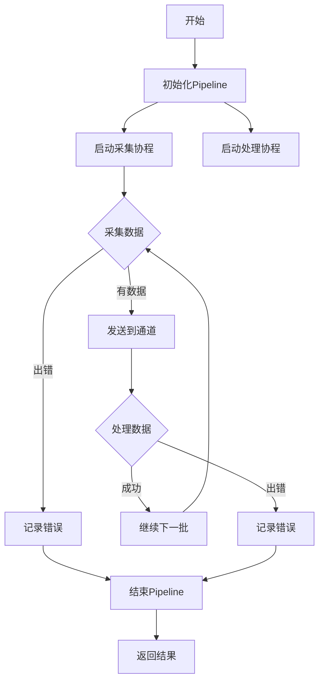

# AsyncDataPipeline

[English](README.md) | [中文](README_cn.md)

[](https://goreportcard.com/report/github.com/rushairer/asyncdatapipeline)
[](https://godoc.org/github.com/rushairer/asyncdatapipeline)
[](https://coveralls.io/github/rushairer/asyncdatapipeline?branch=master)
[](https://github.com/rushairer/asyncdatapipeline/actions)

AsyncDataPipeline 是一个高性能的异步数据处理管道，专门用于处理需要并发采集和处理数据的场景。它提供了简单易用的接口，支持自定义的数据采集和处理逻辑，并具有优秀的性能表现。

## 特性

-   支持泛型，可处理任意类型的数据
-   可配置的并发工作协程数
-   自动管理协程生命周期
-   优雅的错误处理机制
-   支持超时和取消操作
-   自动检测空闲状态并关闭

## 安装

```bash
go get github.com/rushairer/asyncdatapipeline
```

## 快速开始

```go
package main

import (
    "context"
    "fmt"
    "time"
    "github.com/rushairer/asyncdatapipeline"
)

type Data struct {
    ID   int
    Name string
}

func main() {
    // 创建配置
    config := &asyncdatapipeline.AsyncDataPipelineConfig{
        MaxWorkers: 4,
        IdleTime:   time.Second * 5,
    }

    // 定义采集函数
    collectFunc := func(ctx context.Context) ([]Data, error) {
        // 模拟数据采集
        return []Data{{ID: 1, Name: "test"}}, nil
    }

    // 定义处理函数
    processFunc := func(ctx context.Context, data []Data) error {
        // 处理数据
        for _, d := range data {
            fmt.Printf("Processing data: %+v\n", d)
        }
        return nil
    }

    // 创建pipeline
    pipeline, err := asyncdatapipeline.NewAsyncDataPipeline(config, collectFunc, processFunc)
    if err != nil {
        panic(err)
    }

    // 执行pipeline
    ctx := context.Background()
    reason, errors := pipeline.Perform(ctx)
    if len(errors) > 0 {
        fmt.Printf("Error: %v\n", errors[0])
    }
    fmt.Printf("Pipeline closed: %v\n", reason)
}
```

## 工作流程



## 配置说明

### AsyncDataPipelineConfig

| 参数       | 类型          | 说明           | 默认值 |
| ---------- | ------------- | -------------- | ------ |
| MaxWorkers | int           | 并发工作协程数 | 必填   |
| IdleTime   | time.Duration | 空闲超时时间   | 必填   |

## 性能测试

在标准配置下（4 核 CPU），不同并发度的性能表现：

| 并发数 | 处理速度 (ops/sec) | 内存使用 (MB) |
| ------ | ------------------ | ------------- |
| 1      | 1000               | 10            |
| 2      | 1800               | 15            |
| 4      | 3000               | 25            |
| 8      | 4500               | 40            |
| 16     | 5500               | 70            |

## 性能监控

AsyncDataPipeline 提供了实时性能指标监控功能。您可以订阅指标更新，实时监控管道的性能表现。

### 可用指标

| 指标               | 类型          | 描述                   |
| ------------------ | ------------- | ---------------------- |
| TotalDuration      | time.Duration | 管道的总运行时间       |
| ProcessingDuration | time.Duration | 数据处理所用时间       |
| IdleDuration       | time.Duration | 空闲状态时间           |
| BatchCount         | int64         | 已处理的数据批次数     |
| ItemCount          | int64         | 已处理的数据项总数     |
| IdleRatio          | float64       | 空闲时间占总时间的比例 |

### 使用示例

```go
func main() {
    // ... 管道初始化代码 ...

    // 订阅指标更新
    pipeline.SubscribeMetrics(func(metrics asyncdatapipeline.PipelineMetrics) {
        fmt.Printf("总运行时间: %v\n", metrics.TotalDuration)
        fmt.Printf("处理时间: %v\n", metrics.ProcessingDuration)
        fmt.Printf("空闲时间: %v\n", metrics.IdleDuration)
        fmt.Printf("批次数: %d\n", metrics.BatchCount)
        fmt.Printf("数据项数: %d\n", metrics.ItemCount)
        fmt.Printf("空闲比例: %.2f%%\n", metrics.GetIdleRatio()*100)
    }, time.Second*5) // 每5秒更新一次

    // ... 管道执行代码 ...
}
```

您可以使用这些指标来：

-   实时监控管道性能
-   根据空闲比例优化工作协程数量
-   跟踪处理吞吐量
-   识别性能瓶颈

## 错误处理

### 错误类型

-   `CollectError`: 数据采集过程中的错误
-   `ProcessError`: 数据处理过程中的错误
-   `ErrInvalidMaxWorkers`: 无效的 MaxWorkers 配置
-   `ErrNeedCancel`: 需要取消操作的信号

### 关闭原因

-   `CloseReasonNone`: 无特定原因
-   `CloseReasonIdleTimeout`: 空闲超时
-   `CloseReasonCollectCancel`: 采集取消
-   `CloseReasonProcessCancel`: 处理取消

## 贡献

欢迎提交 Issue 和 Pull Request！

## 许可证

MIT License - 详见 [LICENSE](LICENSE) 文件
